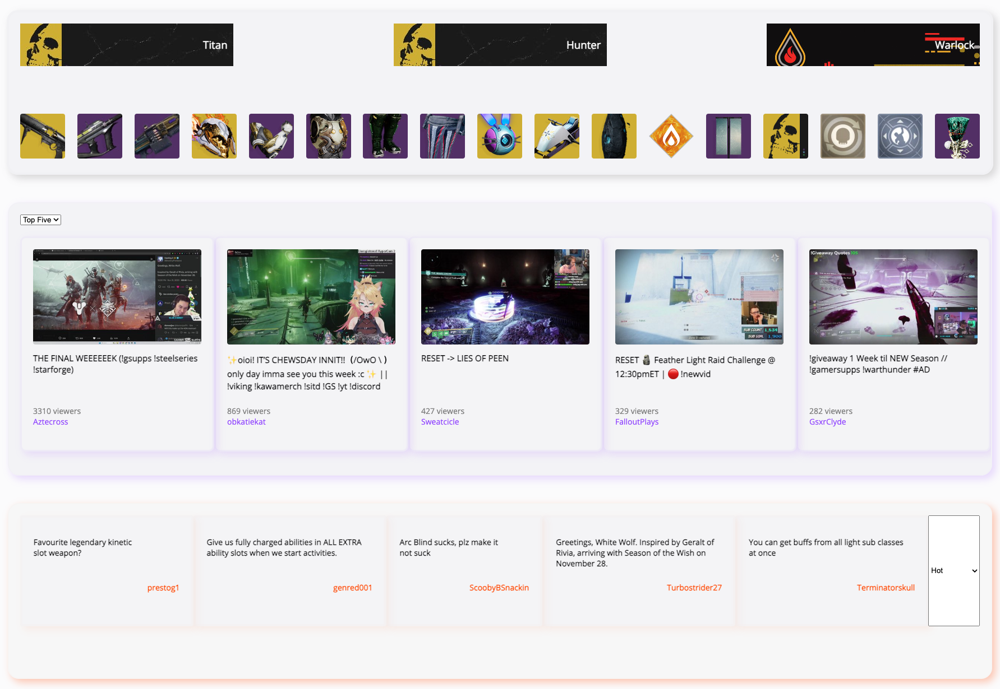

# Destiny 2 Central Hub

## Screenshot

## Configuration
To run this application you first will need Access Tokens from `Bungie`, `Twitch` and `Reddit`.
[Reddit Token](https://github.com/reddit-archive/reddit/wiki/OAuth2), [Bungie Token](https://github.com/Bungie-net/api/wiki/OAuth-Documentation), [Twitch Token](https://dev.twitch.tv/docs/authentication/).

After, create an `.env.development` file in the root of your application. Use the file `.env.example` as your starting guide.

Now, install our dependencies with `npm install` for the backend. After that, you will need to use the library called `live-server`.. you can install it with `npm install -g live-server`.

## Running
run server: `npm run start`  
    - API endpoint `http://localhost:3000`  
    
run web: `cd web && live-server`  
    - WEB `http://localhost:8080`

# Roadmap
## 0.1 version -- integration with bungie.net
- ~~show my current loadout for my last used character. (small image)~~
- ~~show my current sub-class equipped.(small image)~~
- ~~show my ghost, ship and sparrow.(small image)~~

## 0.2 version -- integration with reddit
- ~~show the last 5 current **hot** posts on r/DestinyTheGame~~
- ~~show the last 5 current **top** by period (hour, week, month, year, all time) posts on r/DestinyTheGame~~

## 0.3 version -- integration with twitch
- ~~show top 5 twitch streamers playing the game. Only showing the streamer picture, how many people are watching. Maybe use the banners channel as a background for the miniature.~~

## 0.4 version -- more integration with twitch
- ~~give an option for the user to say which streamer they want to "track" to see if they're live or not. Giving the option between switching "top streaming vs my favorites"~~

## 0.5 version -- work on UI/UX for the project
- ~~make basic UI for the project.~~